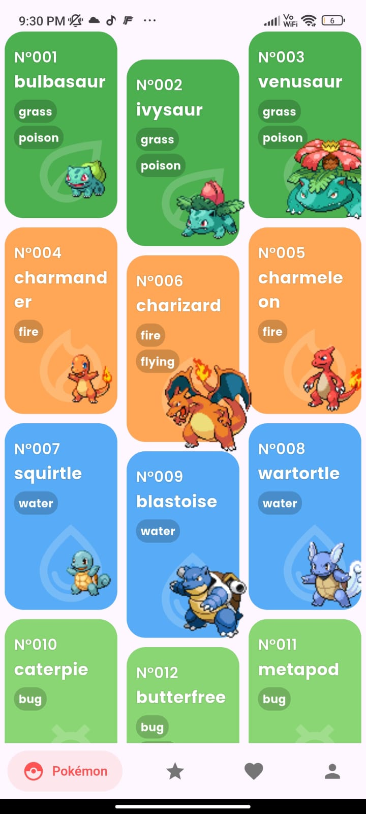

# Flutter Poke API

	

---

Este proyecto es una aplicación Flutter que consume la [PokeAPI](https://pokeapi.co/) para mostrar información sobre Pokémon. La app está desarrollada aplicando los principios SOLID, lo que garantiza un código limpio, mantenible y escalable.

## 🚀 Características
- Consulta y visualización de Pokémon usando la PokeAPI.
- Arquitectura basada en capas (presentación, dominio, infraestructura).
- Uso de principios SOLID para una mejor organización y extensibilidad del código.
- Interfaz moderna y responsiva.

## 🧑‍💻 Principios SOLID aplicados
- **S**: *Single Responsibility Principle* (Responsabilidad Única): Cada clase tiene una única responsabilidad.
- **O**: *Open/Closed Principle* (Abierto/Cerrado): El código está abierto a extensión pero cerrado a modificación.
- **L**: *Liskov Substitution Principle* (Sustitución de Liskov): Las clases hijas pueden sustituir a las clases base sin alterar el funcionamiento.
- **I**: *Interface Segregation Principle* (Segregación de Interfaces): Las interfaces son específicas y no fuerzan a implementar métodos innecesarios.
- **D**: *Dependency Inversion Principle* (Inversión de Dependencias): Se depende de abstracciones y no de implementaciones concretas.

## 📁 Estructura del proyecto
- `lib/`
	- `presentation/`: Pantallas, widgets y proveedores.
	- `domain/`: Entidades, repositorios y casos de uso.
	- `infrastructure/`: Implementaciones de repositorios, modelos y mapeadores.
	- `config/`: Configuración y rutas.
- `assets/`: Imágenes, íconos y recursos estáticos.

## ▶️ Cómo ejecutar
1. Clona el repositorio.
2. Ejecuta `flutter pub get` para instalar dependencias.
3. Corre la app con `flutter run`.

---

¡Disfruta explorando el mundo Pokémon!
